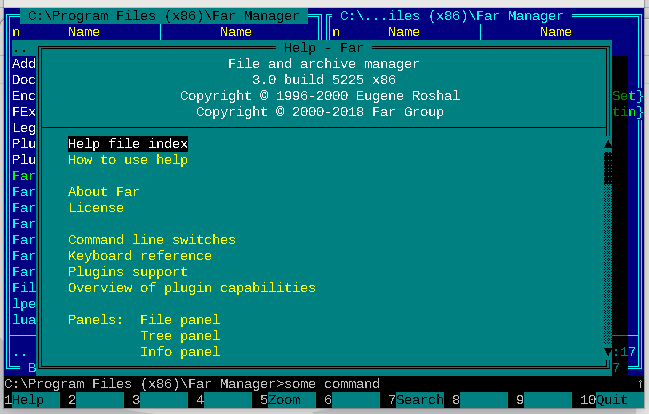

---
* [x] add command line prompt like in Far Manager (show path and enter command)
  * [x] add screen with Far Manager
---
* [x] add bottom bar and **Ctrl+B** keybinding to show that
  * [ ] add screen of bottom bar
  * [ ] add link to **Ctrl+B** docs from Far Manager
  * [ ] https://github.com/jonathanslenders/python-prpromptompt-toolkit/issues/655

https://python-prompt-toolkit.readthedocs.io/en/master/pages/progress_bars.html

---
* [x] pick up right color for toolbar
* [x] show empty keys in the toolbar
* [x] **F10** to quit
---
* [ ] **F1** to show help
